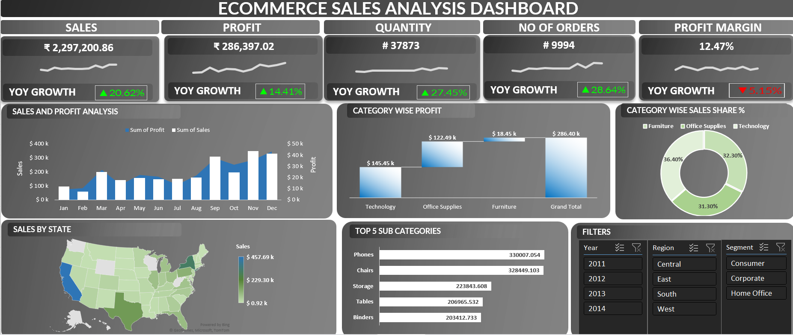

# Ecommerce-Sales-Dashboard-Excel
Interactive Excel dashboard analyzing e-commerce sales, profit and orders
## Tools Used
Excel (Pivot Tables, Charts, Slicers)

## Key Metrics
- Sales: 2.3M
- Profit: 286K
- Orders: 9,994
- Profit margin: 12.47%

## What I Analyzed
- Sales and profit trends by month
- Profit and sales share by category
- Sales by US state
- Top 5 sub-categories by sales
- Filters for year, region and customer segment

## Dashboard Preview

